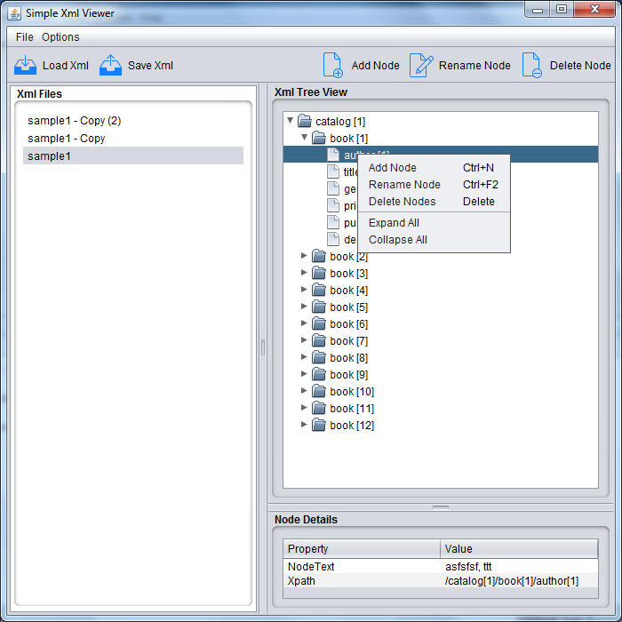
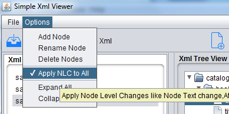

# XmlViewer
Viewing Xml files in Java 

Option to create/edit/delete nodes

You can Simply drag and drop xml files or folder containing xmls to the list on the left.

When you select any xml from the list the tree on the right will be populated with the xml content

On selecting any of the nodes in the tree,the corresponding details will be displayed in the table below.

Xpath will be automatically generated on node selection 

Whenever a new node is added/removed/renamed the changes will be applied automatically to the other xmls loaded in the list based on the xpath of the selected node.

Also node level changes like change in node text or attribute value change will only be applied if `Apply NLC to All` is selected from the Options menu
